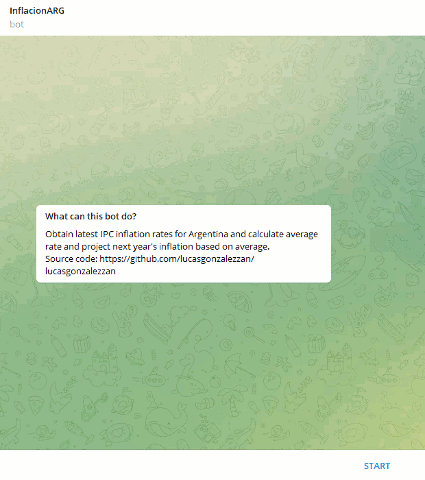

# Argentinian Inflation - a Telegram Bot
## _by Lucas Gonzalez Zan_


 


This is a Telegram Bot designed to gather official information from https://datos.gob.ar/ via API.


## Features

The bot accepts the following commands from any Telegram chat:

- /start 	---	Welcome message
- /help  	---	Bring up inline keyboard with commands
- /update  	---	Update Argentina's inflation rate "IPC" from datos.gob.ar
- /raw - Verify IPC downloaded data, asks for how many months ago
- /time  	---	Return current date and time in Argentina
- /calcanual   --- Calculate the cumulative inflation in last year, semester and trimester
- /calcmeses  ---	Same as /calcanual  but asks for the period in months
- /promedio --- Calculate the average inflation per month for the year, semester and trimester
- /project --- Calculate the average inflation per month [^1] in a given periods an returns the inflation in next months/years, assuming constant inflation for each month
- /info --- Return this source code link

[^1]: The average is computed as the root of the total inflation (radicand) with radix as the number of months:
(<sup> months </sup> √ inf). In other words, a constant inflation of the average over the period of months results in the given total inflation.

<!-- [, align=center]()
 --> 

 


## Usage

 ```
TOKEN=1234567890:ABCDEFGHIJKMNLOPQRSTUVXYZabcdefghij 
export TOKEN
python bot.py
```

Output log:
> 2022-03-16 17:03:28,297 - root - DEBUG - Payload is: {'ok': True, 'result': []} Status is: 200 <br/>
> 2022-03-16 17:03:28,297 - root - INFO - No messages to process. <br/>
> 2022-03-16 17:04:27,464 - root - INFO - Processing 1 menssages, last update_id was 441657297 <br/>
> 2022-03-16 17:04:27,464 - telegram_msg_process - DEBUG - Last command was: None <br/>

Logging is saved in "rotating.bot.log" which rotate logs every 2MB into a new file. Optionally, we can set the debugging level via the environment variable:
``` 
LOGLVL = DEBUG
export LOGLVL
```


## Tech

No special modules are needed, only an updated release of python for new features, such as `case`:

- python-3.10.2


## Installation

No packages needed


## License


**It's Free Software :)**